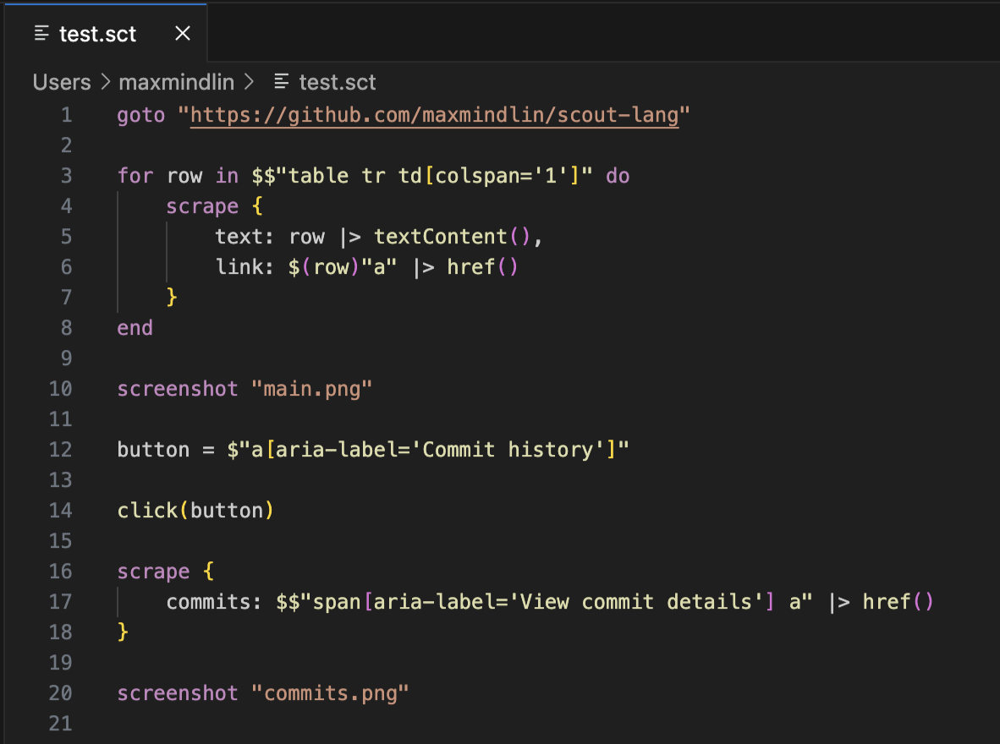

 

A Web Crawling Programming Language

ScoutLang is a DSL made for web scraping focusing on a simple, expressive syntax. A powerful web crawling stack is abstracted away, allowing you to write easy to read, powerful scraping scripts.

## Iterative script building

ScoutLang comes bundled with a full REPL and a powerful debugging mode, allowing you to visualize your web scraping scripts in real time.

